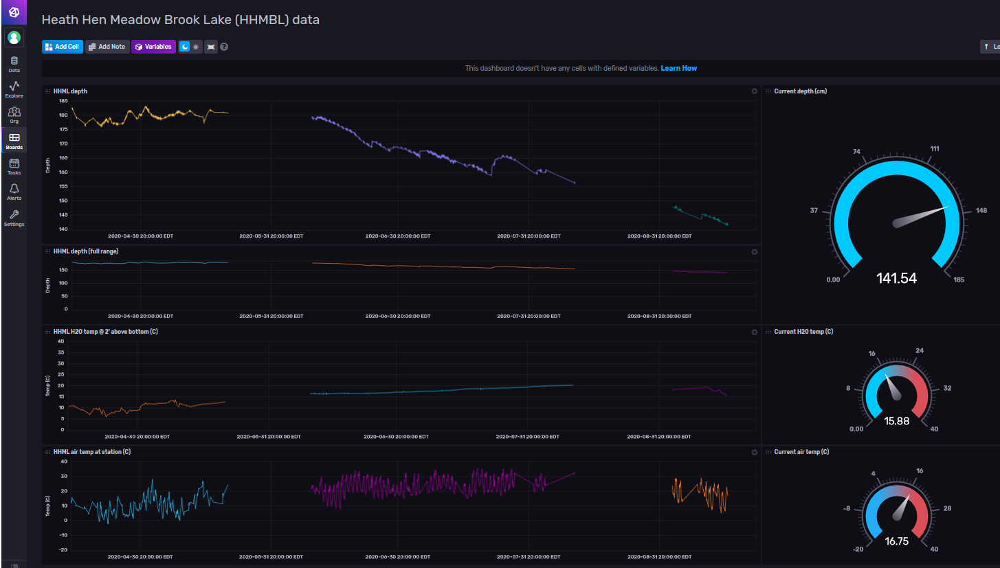

# helium diy gateway miner
I'm using a helium-based lorawan network to receive environmental data from nodes placed in wetlands near my home. The gateway and miner are DIY.

The nodes collect values for water depth, water temp, air temp, etc. Here is an influxdb v2 dashboard screenshot:



Thought I would post info about my build. It's been running since ~May 2020, with occasional down times caused by me or by helium. It's name is [able-tawny-pelican](https://explorer.helium.com/hotspots/112u5KiMDTqUQUYunAQSnnNieLThe7g54e6dzWcQLLUKG9h6gLA7), and is a member of the alpha test for DIYs to earn HNT.

(Note: my interest is primarily in the nodes and data collection, not the HNT/mining aspect.)

The data pathway is something like this:
```
node (arduino adafruit feather or arduino BSFrance)
	|
gateway (rPi4, POE, RAK2245)                      \
	|                                          | (inside my network)
miner (docker image run with podman on CentOS8)   /
	|
helium network (mqtt integration)                  | (at helium)	
	|
mqtt broker (CentOS8)                            \
	|                                         \
data decoder (python daemon)                       | (inside my network)
	|                                         /
influxdbv2 (time series database)                /
```
## Hardware
 - Raspberry Pi 4
 - Power Over Ethernet (PoE) hat
 - [RAK 2245](https://store.rakwireless.com/products/rak2245-pi-hat)
 - [Nebra IP67](https://uk.pi-supply.com/products/die-cast-outdoor-weatherproof-enclosure) enclosure from PiSupply in the UK
 - [Antenna pigtail](https://uk.pi-supply.com/products/ufl-ipex-to-n-type-bulkhead) needed to mount antenna on Nebra
 - [Antenna](https://smile.amazon.com/gp/product/B07SL9KWXT)
 - [GPS antenna](https://www.digikey.com/product-detail/en/taoglas-limited/AA.162.301111/931-1238-ND/3945614), outdoor, magnetic base
 - [Mounting pole](https://smile.amazon.com/gp/product/B006J1WSGI)
### Micellaneous hardware
 - [Gland assortment](https://smile.amazon.com/gp/product/B077R1RT2T)
 - [uFl to SMA female](https://smile.amazon.com/onelinkmore-Connector-Pigtail-Bulkhead-Extension/dp/B01AJQ33Y4) antenna connector pigtail
### Images


### Build notes
 - Heat: (Not shown in image.) There is a piece of aluminum about 5mm thick sitting on top of the RAK2245. The aluminum was made sufficiently thicker with a few wraps of aluminum foil to bring it in solid contact with the Nebra case when the cover is closed. This way any RAK heat dissipates directly to the case. I used thermal paste (i.e. used when mounting a heat sink to a CPU) between the RAK and aluminum, and between the aluminum and the case.
 - GPS antenna is just magnetically attached to a long threaded bolt screwed into one of the Nebra case gland holes.
 - Standoffs: The PiSupply cases has a lot of standoffs, but their arrangement seems random. It comes with 
  a cheap piece of sheet metal, but that is only held by two screws, and it is too flexible and not supportive
  of boards. Strangely, for a company called "PiSupply" that seems to be the manufacturer of this cases, this case does not contain 
  4 standoffs set in the dimensions for a Raspberry Pi. , So, I picked one standoff, and then used JBWeld Cold-Weld Steel epoxy 
  to mount 3 more (see image) standoffs in the right places. 
- Entire unit is mounted outside on our barn.
## Software
I basically followed the guidance at helium: [Build a Hotspot](https://developer.helium.com/hotspot/developer-setup)
A few notes:
- Miner runs on an PC running CentOS8, not on the rPi gateway device. CentOS (like Redhat) does not use docker. It uses 
podman, which, unlike docker, can be run in user space. The 'podman' command is a drop-in replacement for 'docker'.
- Here are some command lines I found useful when debugging and monitoring. They do some simple rummaging around in the log files:
  - On the gateway:
```
tail -n 1000 -f /var/log/syslog | grep -A5 'INFO: Received pkt from mote:'
tail -n 1000 -f /var/log/syslog | egrep 'JSON (up|down)'
tail -n 1000 -f /var/log/syslog | grep -A21 '##### 2020'
```
   - On the miner:
```
curl https://api.helium.io/v1/blocks/height && echo && podman exec miner miner info height
podman exec miner tail -f /var/log/miner/console.log | egrep '(error|warning|notice)'
podman exec miner tail -f /var/log/miner/console.log | egrep 'lora'
```
<!--stackedit_data:
eyJoaXN0b3J5IjpbLTE3OTk5ODkzODEsLTUzOTk3MDA4NiwtNj
c5NDM5NDcsLTE3OTM2ODMwNTQsMjAxODcwOTE0MSwxOTgyNDk4
MzU3LDQ3OTIwMDE3MywxNTk2NjQxMTc4XX0=
-->
